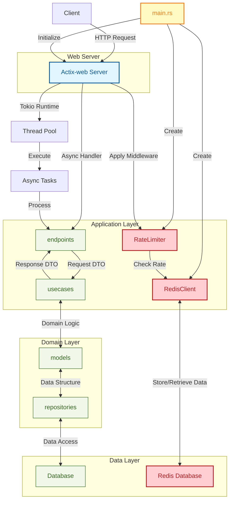

```mermaid
graph TD
    A[Client] -->|HTTP Request| B[Actix-web Server]
    B -->|Async Handler| D[endpoints]
    D -->|Request DTO| E[usecases]
    E -->|Response DTO| D
    E <-->|Domain Logic| F[models]
    F <-->|Data Structure| G[repositories]
    G <-->|Data Access| H[Database]

    K[main.rs] -->|Initialize| B
    K -->|Create| M[RedisClient]
    K -->|Create| N[RateLimiter]

    B -->|Apply Middleware| N
    N -->|Check Rate| M
    M <-->|Store/Retrieve Data| O[Redis Database]

    subgraph "Web Server"
    B
    end

    subgraph "Application Layer"
    D
    E
    N
    M
    end

    subgraph "Domain Layer"
    F
    G
    end

    subgraph "Data Layer"
    H
    O
    end

    classDef webServer fill:#e1f5fe,stroke:#01579b,stroke-width:2px,color:#01579b;
    class B webServer;
    classDef mainFile fill:#fff9c4,stroke:#f57f17,stroke-width:2px,color:#f57f17;
    class K mainFile;
    classDef layer fill:#f1f8e9,stroke:#33691e,stroke-width:1px,color:#33691e;
    class D,E,F,G,H,N,M,O layer;
    classDef redis fill:#ffcdd2,stroke:#b71c1c,stroke-width:2px,color:#b71c1c;
    class M,N,O redis;

    B -->|Tokio Runtime| P[Thread Pool]
    P -->|Execute| Q[Async Tasks]
    Q -->|Process| D
```
