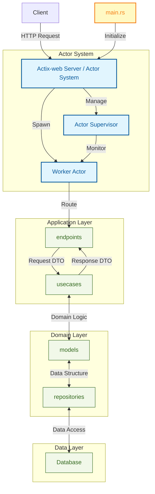

```mermaid
graph TD
    A[Client] -->|HTTP Request| B[Actix-web Server / Actor System]
    B -->|Spawn| C[Worker Actor]
    C -->|Route| D[endpoints]
    D -->|Request DTO| E[usecases]
    E -->|Response DTO| D
    E <-->|Domain Logic| F[models]
    F <-->|Data Structure| G[repositories]
    G <-->|Data Access| H[Database]

    B -->|Manage| I[Actor Supervisor]
    I -->|Monitor| C

    K[main.rs] -->|Initialize| B

    subgraph "Actor System"
    B
    C
    I
    end

    subgraph "Application Layer"
    D
    E
    end

    subgraph "Domain Layer"
    F
    G
    end

    subgraph "Data Layer"
    H
    end

    classDef actor fill:#e1f5fe,stroke:#01579b,stroke-width:2px,color:#01579b;
    class B,C,I actor;
    classDef mainFile fill:#fff9c4,stroke:#f57f17,stroke-width:2px,color:#f57f17;
    class K mainFile;
    classDef layer fill:#f1f8e9,stroke:#33691e,stroke-width:1px,color:#33691e;
    class D,E,F,G,H layer;
```
