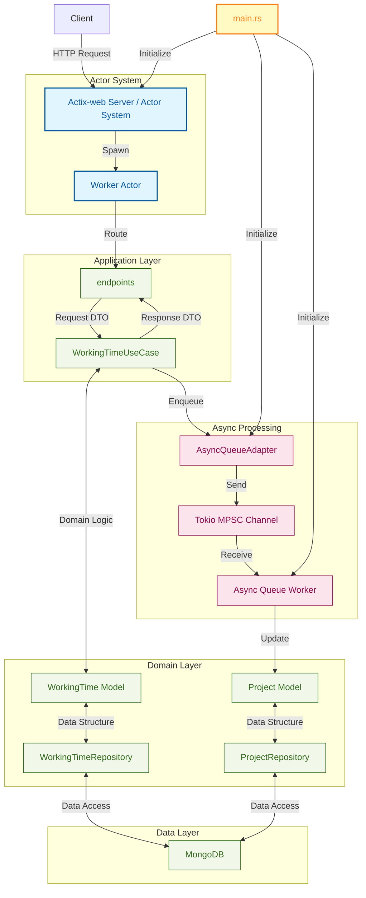

# 全体図

- アーキテクチャ全体像
- プロジェクト単位での稼働時間集計の非同期キュー（`working_time` + `project`）

```mermaid
graph TD
    A[Client] -->|HTTP Request| B[Actix-web Server / Actor System]
    B -->|Spawn| C[Worker Actor]
    C -->|Route| D[endpoints]
    D -->|Request DTO| E[WorkingTimeUseCase]
    E -->|Response DTO| D
    E <-->|Domain Logic| F[WorkingTime Model]
    F <-->|Data Structure| G[WorkingTimeRepository]
    G <-->|Data Access| H[MongoDB]

    E -->|Enqueue| I[AsyncQueueAdapter]
    I -->|Send| J[Tokio MPSC Channel]
    J -->|Receive| K[Async Queue Worker]
    K -->|Update| L[Project Model]
    L <-->|Data Structure| M[ProjectRepository]
    M <-->|Data Access| H

    N[main.rs] -->|Initialize| B
    N -->|Initialize| I
    N -->|Initialize| K

    subgraph "Actor System"
    B
    C
    end

    subgraph "Application Layer"
    D
    E
    end

    subgraph "Domain Layer"
    F
    G
    L
    M
    end

    subgraph "Data Layer"
    H
    end

    subgraph "Async Processing"
    I
    J
    K
    end

    classDef actor fill:#e1f5fe,stroke:#01579b,stroke-width:2px,color:#01579b;
    class B,C actor;
    classDef mainFile fill:#fff9c4,stroke:#f57f17,stroke-width:2px,color:#f57f17;
    class N mainFile;
    classDef layer fill:#f1f8e9,stroke:#33691e,stroke-width:1px,color:#33691e;
    class D,E,F,G,L,M,H layer;
    classDef async fill:#fce4ec,stroke:#880e4f,stroke-width:1px,color:#880e4f;
    class I,J,K async;
```
